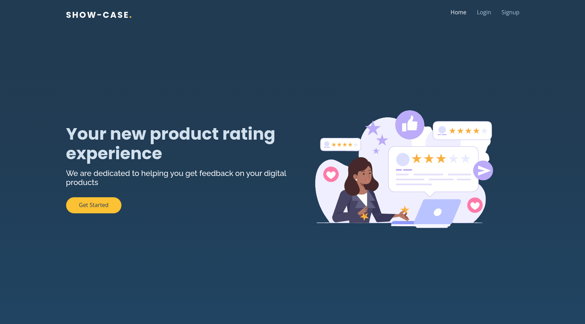
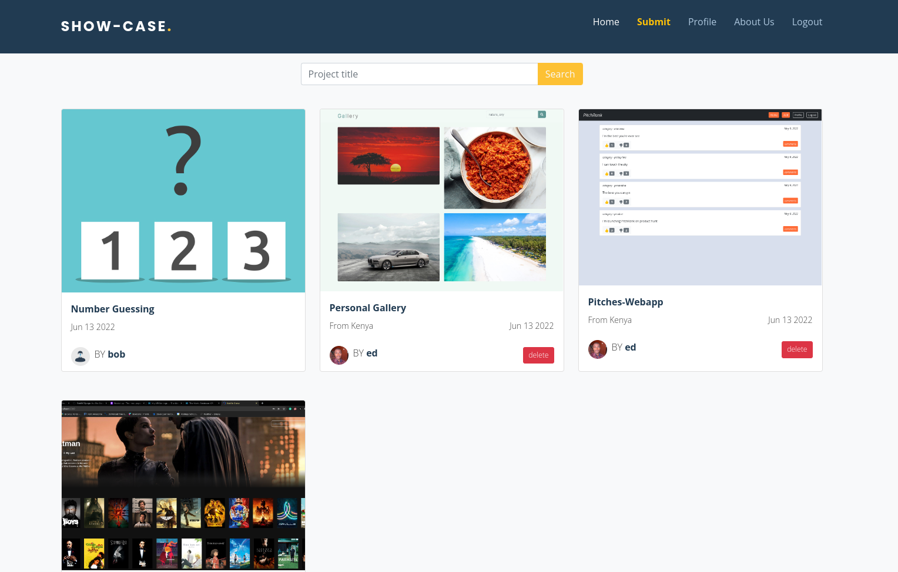

# Show-Case
Show-Case is a website similar to Awaards. It is built with Django 4, Django-Bootstrap5, PostgreSQL, Cloudinary and hosted on Heroku. It is a platform where users can post their projects and other users can vote on them based on the usability, content and design of the project. Users can also add their info to their profile for other users to see incase they would like to reach out.



## Getting Started

- Type the following command in your terminal to clone this repository

```
git clone https://github.com/Edu58/Django-Awwards-Clone.git
```

If you are using SSH, use the following command

```
git clone git@github.com:Edu58/Django-Awwards-Clone.git
```

When you run the commands successfully, you should have a local version of this repository.

### Prerequisites

- A computer with Python 3 install. Check [here](https://realpython.com/installing-python/) for
  further [instructions](https://realpython.com/installing-python/)
- Access to the Internet
- An IDE of your choice e.g. Pycharm, VS Code, Sublime Text

### Installing

Before starting the application, run ```pip install -r requirements.txt``` to install the project dependencies.

create .env file in the project root directory and populate it with:
```
SECRET_KEY= '<your django project secret key>'
DEBUG= '<True or False>'
DB_NAME= <your db name>
DB_USER= <your db username>
DB_PASSWORD= <your db password>
CLOUD_NAME= <your cloudinary name>
CLOUD_API_KEY= <your cloudinary api key>
CLOUD_API_SECRET= <your cloudinary api secret>
```

To run the app, unzip the cloned folder if it is zipped. Otherwise, navigate inside the folder and
run ```python manage.py runserver``` or ```python manage.py server``` in your terminal. Any of these 2 should start the
server at
localhost:8000. Once the server is running, open your browser and enter localhost:8000 in your url bar of your
preferred browser, and you should be able to use the app now. This will only work on the computer running the server. It
is not available to anyone else.

When you signup, login and submit a project successfully, you should see a similar page to the one below.


## Accessing the API
To get a list of profiles, send a GET request to ```https://workshowcase.herokuapp.com/api/profiles/```.
<br>
To get a list of projects, send a GET request to ```https://workshowcase.herokuapp.com/api/projects/```.


## Deployment

This project can be deployed for free on Heroku. Follow
these [instructions](https://realpython.com/django-hosting-on-heroku/) to deploy.

## Built With

* [Django](https://www.djangoproject.com/) - The web framework used
* [Cloudinary](https://cloudinary.com/) - For storing images
* [Django-Bootstrap-V5](https://pypi.org/project/django-bootstrap-v5/) - CSS Framework
* [JQuery](https://jquery.com/) - Javascript Library used for fade effects
* [PostgreSQL](https://www.postgresql.org/) - Database used

## Known Bugs
My List feature is not working

Feel free to submit a pull request or reach out at edumuriithi58@gmail.com.

## Contributing

Feel free to submit a pull request or reach out at edumuriithi58@gmail.com.

## Authors

* **Edwin Karimi** - *Initial work* - [Django-Awaards-Clone](https://github.com/Edu58/Django-Awwards-Clone)

- Twitter - [@GISDevEd](https://twitter.com/GISDevEd)
- Linkedin - [edwin-karimi](https://www.linkedin.com/in/edwin-karimi/)
  <br>
  <br>
- No contributors yet

## License

This project is licensed under the MIT License - see the [LICENSE.md](LICENSE) file for details